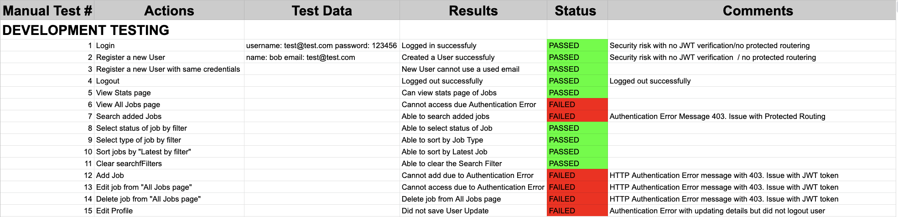

## **JOBTRACK APP**

### **R4 - Demonstrate your ability to work in a team**

**Project Management and Task Delegation Methodology**

Discord was the main point of communication throughout this project. We did a daily stand up with each other to keep track of what challenges we were facing and the progress of the project. We also used discord to keep us accountable for spending time on the assessment and we would schedule a voice and code. If we ran into issues or problems, we could help each other via screen share. We utilised Trello and a Kanban board throughout Part B of this assessment to keep track of what stage we were on and to keep each other accountable to make sure that the tasks were completed. We also used it to delegate the tasks that each of us had. Job had the role of doing mainly the server side and I looked after the front end. We also helped each other despite our tasks being different so that we could do a good job and there were times where one of us were able to fix the problem despite working on different parts of the application. This helped us work better and complete the project. 

Below is the progress of our application and the Trello Board can be found in the link below:

**Trello Board:** [Trello](https://trello.com/b/q6LJArRy/t3-mern-full-stack-application)

---

### **R10 - A link (URL) to your deployed website**

---

**Website:** [JobTracker](https://jobtracking-app.herokuapp.com/)

### **R11 - A link to your GitHub repository (repo)**

---

**Github repo:** [Github Repo](https://github.com/mattty-t/T32B)

---

## **R2 - Libraries**

### **React ^12.1.2**

React is a JavaScript based UI development library that is used for building interactive user interface based components.

### **React router/React Router DOM ^6.2.1**

React router provides all the core functionality for React Router DOM. It is a library that allows routes to be defined in a declarative style. React Router DOM was used in this application and it allows for dynamic routing in the web application.

### **Redux**

Redux is an open-source JavaScript library for managing and centralising application state. It helps with shared state management throughout the application. In redux, the state of the application is kept in a store and each component can access any state that it needs from this store.

### **Axios ^0.24.0**

Axios is a promise based library in ReactJS that is used to communicate with the backend and also supports Promise API. It is a library that is used to make a request to an API and return that data from the API. This is then used to perform actions with the data in our React application. It allows us to easily communicate with APIs easily in the application also.

### **Mongoose ^4.2.2**

Mongoose is a Node.js based Object Data Modelling library for Node.js and MongoDB. It helps manage the relationships between data, provides schema validation and is used to translate objects between objects in code and the representation of these objects in MongoDB.

### **Recharts ^2.1.8**

Recharts is a redefined chart library and is used to help write charts in React apploications.

---

### **R8 - Provides evidence of user testing:**

We utilised user manual testing which was tracked in an excel spread sheet during development stages of the application and production testing after the deployment of the application on Heroku. The testing can be seen below.

---

#### **Development Testing environment**

#### **Production Testing environment**

